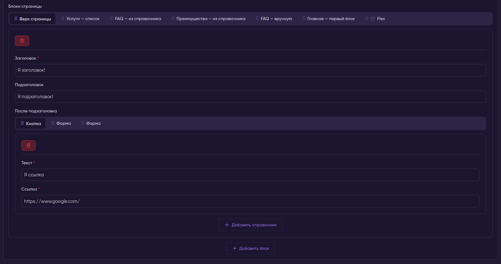
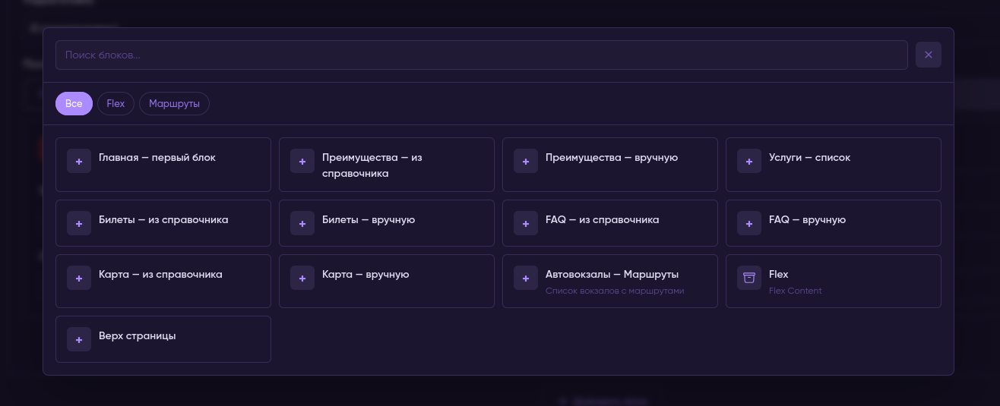

# MoonShine Flexible Layouts




Flexible content blocks field for MoonShine 4. Build page builder-style layouts with unlimited nesting, drag-to-reorder, and AJAX-powered block management.

**Language:** [English](#english) (default) · [Русский](#russian)

---

<a id="english"></a>

## English

Flexible content blocks field for MoonShine 4. Build page builder-style layouts with unlimited nesting, drag-to-reorder, and AJAX-powered block management.

### Features

- **Tab-based UI** — blocks displayed as reorderable tabs with optional icons
- **Unlimited nesting** — Flexible Layouts inside block fields just work
- **Drag to reorder** — powered by SortableJS via MoonShine's native `iterable` API
- **AJAX add/remove** — blocks are fetched on-demand from the server, no page reload
- **Duplicate blocks** — one click copies a block with all field values, inserted right after the source
- **Limit per block type** — restrict how many instances of each block can be added (enforced server-side)
- **Native reindex** — reuses `MoonShine.iterable.reindex()` for correct form field naming at any depth
- **Block picker modal** — Gutenberg-style modal with search and category grouping
- **Layout components** — use MoonShine `Flex`, `Column`, and other layout components inside blocks for multi-column field layouts
- **Data safety** — blocks removed from code but still stored in JSON survive save/load round-trips (unknown `_type` passthrough)
- **Localization** — ships with English and Russian translations, extensible to any language

### Requirements

- PHP 8.2+
- Laravel 12+
- MoonShine 4+

### Installation

```bash
composer require povly/moonshine-flexible-layouts
```

Publish assets:

```bash
php artisan vendor:publish --tag=flexible-layouts
```

Optionally publish the config and translations:

```bash
php artisan vendor:publish --tag=flexible-layouts-config
php artisan vendor:publish --tag=flexible-layouts-lang
```

Register the cast on your model:

```php
protected function casts(): array
{
    return [
        'content' => \Povly\FlexibleLayouts\Casts\FlexibleCast::class,
    ];
}
```

### Quick Start

```php
use Povly\FlexibleLayouts\Fields\FlexibleLayouts;

FlexibleLayouts::make('Content', 'content')
    ->block('hero', 'Hero', [
        Text::make('Title', 'title'),
        Image::make('Background', 'image'),
    ])
    ->block('text', 'Text Block', [
        Textarea::make('Body', 'body'),
    ])
    ->block('gallery', 'Gallery', [
        Json::make('Images', 'images'),
    ]);
```

### Usage

#### Block Registration

The `block()` method accepts:

| Parameter | Type | Description |
|-----------|------|-------------|
| `$name` | `string` | Snake_case key stored in JSON as `_type` |
| `$title` | `string` | Human-readable label shown in tabs and picker |
| `$fields` | `iterable` | MoonShine fields (can include nested FlexibleLayouts) |
| `$limit` | `?int` | Max instances of this block type (default: unlimited) |
| `$category` | `?string` | Grouping label in the picker modal |
| `$description` | `?string` | Short description shown in the picker card |
| `$icon` | `?string` | MoonShine icon name, emoji, or SVG string |

Basic usage:

```php
->block('cta', 'Call to Action', [
    Text::make('Button Text', 'label'),
    Text::make('Link', 'url'),
], limit: 1)
```

With category, description, and icon (use named args):

```php
// MoonShine icon names (301+ Heroicons built-in)
->block('hero', 'Hero', [
    Text::make('Title', 'title'),
    Image::make('Background', 'image'),
], category: 'Header', description: 'Large banner with background', icon: 'photo')

->block('gallery', 'Gallery', [
    Json::make('Images', 'images'),
], category: 'Media', description: 'Image grid gallery', icon: 'rectangle-stack')

->block('wysiwyg', 'Text Editor', [
    Textarea::make('Body', 'body'),
], category: 'Content', description: 'Rich text content', icon: 'document-text')

// Emoji also works
->block('cta', 'Call to Action', [
    Text::make('Text', 'label'),
    Text::make('Link', 'url'),
], limit: 1, icon: '🔗')
```

#### Icons

The `icon` parameter accepts three types:

| Type | Example | Renders as |
|------|---------|------------|
| MoonShine icon name | `'photo'` | SVG from `moonshine::icons.photo` |
| Emoji | `'📷'` | Raw text |
| Raw SVG | `'<svg>...</svg>'` | Pass-through HTML |

MoonShine includes **301 Heroicons** (stroke-based, 24×24). Browse them in `vendor/moonshine/moonshine/src/UI/resources/views/icons/`. Common examples: `users`, `photo`, `document-text`, `rectangle-stack`, `bars-3`, `cog-6-tooth`, `star`, `bolt`, `globe-alt`, `bookmark`.

Icons appear in both the tab label and the picker card.

> ⚠️ **Security:** `icon` is rendered as raw HTML and must only receive developer-trusted values — never user input.

Blocks without a category are shown in an ungrouped section. When all blocks lack categories, the category pills row is hidden automatically.

#### Block Picker Modal

Clicking **Add block** opens a Gutenberg-style modal with:

- **Search** — type to filter by title, description, or block name
- **Category tabs** — click to filter by category (only shown when 2+ categories exist)
- **Grid of cards** — icon + title + description per block; click to add

Press `Esc` or click outside the modal to close.

##### z-index / compatibility

The picker overlay lives on the MoonShine core modal layer — `z-index: var(--z-modal, 1100)`. It stays below core menus (`--z-menu: 1200`) and toasts (`--z-toast: 1300`), and packages with dedicated elevated layers (e.g. `moonshine-media-manager` dialogs at 1150/1250) always stack above it. Do not raise the overlay above the core scale — that was the original 9999 bug.

#### Nested Flexible Layouts

You can put a `FlexibleLayouts` field inside any block. Nested layouts support the same features (drag, add, remove, reindex):

```php
->block('section', 'Section', [
    Text::make('Title', 'title'),
    FlexibleLayouts::make('Blocks', 'blocks')
        ->block('button', 'Button', [
            Text::make('Text', 'text'),
            Text::make('Link', 'link'),
        ])
        ->block('form', 'Form', [
            Select::make('Type', 'form_type')->options([
                'hotel' => 'Hotel',
                'tickets' => 'Tickets',
            ]),
            Text::make('Redirect URL', 'url'),
        ]),
])
```

#### Disabling Features

```php
->disableAdd()     // hide the "Add block" button
->disableRemove()  // hide the remove button on blocks
->disableDuplicate()  // hide the duplicate button on blocks
->disableSort()    // disable drag-to-reorder
```

#### Custom Buttons

```php
->addButton(ActionButton::make('Add')->primary())
->removeButton(ActionButton::make('Delete')->icon('trash')->error())
->duplicateButton(ActionButton::make('Duplicate')->icon('square-2-stack')->secondary())
```

#### Duplicating Blocks

Every block header includes a duplicate button right after the remove button. It fetches a fresh server-rendered instance of the same block type (so field ids/names stay unique and per-type limits are enforced server-side), copies all field values from the source block, and inserts the copy directly after it. File fields cannot be copied (browser limitation) — they start empty in the duplicate. A `flexible-layouts:block-duplicated` DOM event is dispatched after each duplication.

#### Custom Labels per Field

By default, all Flexible Layouts fields share the same UI labels from `messages.php`. Use `->transKey()` to give a specific field its own set of labels — useful for nested layouts with different content types:

```php
// Top-level — default labels ("Add block", "Search blocks...")
FlexibleLayouts::make('Blocks', 'blocks')
    ->block('hero', 'Hero', [...])

// Nested — custom labels via separate translation file
->block('section', 'Section', [
    Text::make('Title', 'title'),

    FlexibleLayouts::make('Refs', 'refs')
        ->transKey('refs')   // uses flexible-layouts::refs.* translations
        ->block('reference', 'Reference', [
            Text::make('Title', 'title'),
        ]),
])
```

Create `lang/vendor/flexible-layouts/en/refs.php`:

```php
return [
    'add_block'       => 'Add reference',
    'search_blocks'   => 'Search references...',
    'no_blocks_found' => 'No references found',
    'all_categories'  => 'All',
];
```

Labels resolve in order: `flexible-layouts::refs.{key}` → if missing → `flexible-layouts::messages.{key}`. An example file ships in `lang/en/refs.php` and `lang/ru/refs.php`.

#### Multi-column Layouts

Use MoonShine's native `Flex` and `Column` components inside blocks for side-by-side fields:

```php
->block('hero', 'Hero', [
    Flex::make([
        Column::make([
            Text::make('Title', 'title'),
        ])->columnSpan(6),

        Column::make([
            Text::make('Subtitle', 'subtitle'),
        ])->columnSpan(6),
    ]),
])
```

`columnSpan(6)` = half width (out of 12-column grid). Use `columnSpan(4)` for three columns, `columnSpan(3)` for four, etc.

### Configuration

Publish the config file:

```bash
php artisan vendor:publish --tag=flexible-layouts-config
```

```php
// config/flexible-layouts.php
return [
    'route_prefix' => 'flexible-layouts',
    'logging' => env('FLEXIBLE_LAYOUTS_LOGGING', config('app.debug')),
];
```

- `route_prefix` — URL prefix of the AJAX route: `POST {prefix}/store/{pageUri}/{resourceUri?}`.
- `logging` — enables diagnostic logs (skipped/preserved unknown block types, client-supplied limit counts). JSON encode/decode errors in the cast are always logged at error level.

> The package route is registered inside `Route::moonshine()` and inherits core auth/web/CSRF middleware — no `middleware` key exists or is needed.

### Translations

The package ships with English and Russian translations. The UI adapts to the app locale automatically.

Available keys:

| Key | EN | RU |
|-----|----|----|
| `add_block` | Add block | Добавить блок |
| `search_blocks` | Search blocks... | Поиск блоков... |
| `no_blocks_found` | No blocks found | Блоки не найдены |
| `all_categories` | All | Все |
| `duplicate_block` | Duplicate | Дублировать |

Publish translations to customize or add new languages:

```bash
php artisan vendor:publish --tag=flexible-layouts-lang
```

To add a language, copy any file to a new locale folder:

```bash
# Example: add German
cp lang/vendor/flexible-layouts/en/messages.php lang/vendor/flexible-layouts/de/messages.php
```

```php
// lang/vendor/flexible-layouts/de/messages.php
return [
    'add_block' => 'Block hinzufügen',
    'search_blocks' => 'Blöcke suchen...',
    'no_blocks_found' => 'Keine Blöcke gefunden',
    'all_categories' => 'Alle',
];
```

### Data Format

The field stores data as a flat JSON array. Each entry has a `_type` key and the block's field values:

```json
[
  {
    "_type": "hero",
    "title": "Welcome",
    "image": "hero-bg.jpg"
  },
  {
    "_type": "section",
    "title": "About Us",
    "blocks": [
      {
        "_type": "button",
        "text": "Learn More",
        "link": "/about"
      }
    ]
  }
]
```

#### Unknown `_type` handling

Block types removed from code but still present in stored JSON are **not lost**:

| Entry state | Render | Save | Field callbacks |
|-------------|--------|------|-----------------|
| Known `_type` | rendered | fields applied | run |
| Unknown string `_type` | skipped (+ warning if logging on) | preserved verbatim (+ warning if logging on) | skipped |
| No `_type` | skipped | dropped | skipped |

This makes block-type migrations safe: unrecognized entries keep round-tripping through save → load until you re-register or explicitly remove them. The cast caps JSON nesting depth at 64 (DoS protection).

### Development

```bash
# Install JS dependencies
bun install

# Build assets
bun run build

# Watch mode
bun run dev
```

Assets are built to `dist/` and published to `public/vendor/flexible-layouts/`. See [docs/development.md](docs/development.md) for build internals and debugging.

---

<a id="russian"></a>

## Русский

Поле гибких контентных блоков для MoonShine 4. Стройте макеты в стиле конструктора страниц: неограниченная вложенность, drag-сортировка и AJAX-управление блоками.

### Возможности

- **Tab-based UI** — блоки отображаются как переупорядочиваемые табы с опциональными иконками
- **Неограниченная вложенность** — Flexible Layouts внутри полей блоков работает рекурсивно
- **Drag-сортировка** — SortableJS через нативный API `iterable` ядра MoonShine
- **AJAX add/remove** — блоки рендерятся по требованию сервером, без перезагрузки страницы
- **Дублирование блоков** — один клик: блок копируется со всеми значениями полей и вставляется сразу после исходного
- **Лимит на тип блока** — ограничение числа инстансов каждого типа (проверяется на сервере)
- **Нативный reindex** — переиспользуется `MoonShine.iterable.reindex()` для корректного именования полей формы на любой глубине
- **Модальный пикер блоков** — модал в стиле Gutenberg с поиском и группировкой по категориям
- **Layout-компоненты** — нативные `Flex`, `Column` и другие компоненты внутри блоков для мультиколоночных раскладок
- **Сохранность данных** — блоки, удалённые из кода, но оставшиеся в JSON, переживают циклы save/load (passthrough неизвестных `_type`)
- **Локализация** — переводы EN и RU из коробки, расширяется на любой язык

### Требования

- PHP 8.2+
- Laravel 12+
- MoonShine 4+

### Установка

```bash
composer require povly/moonshine-flexible-layouts
```

Опубликуйте собранные ассеты:

```bash
php artisan vendor:publish --tag=flexible-layouts
```

Опционально — конфиг и переводы:

```bash
php artisan vendor:publish --tag=flexible-layouts-config
php artisan vendor:publish --tag=flexible-layouts-lang
```

Зарегистрируйте каст на модели:

```php
protected function casts(): array
{
    return [
        'content' => \Povly\FlexibleLayouts\Casts\FlexibleCast::class,
    ];
}
```

### Быстрый старт

```php
use Povly\FlexibleLayouts\Fields\FlexibleLayouts;

FlexibleLayouts::make('Контент', 'content')
    ->block('hero', 'Hero', [
        Text::make('Заголовок', 'title'),
        Image::make('Фон', 'image'),
    ])
    ->block('text', 'Текстовый блок', [
        Textarea::make('Текст', 'body'),
    ])
    ->block('gallery', 'Галерея', [
        Json::make('Изображения', 'images'),
    ]);
```

### Использование

#### Регистрация блоков

Метод `block()` принимает:

| Параметр | Тип | Описание |
|-----------|------|----------|
| `$name` | `string` | Ключ `snake_case`, сохраняется в JSON как `_type` |
| `$title` | `string` | Человекочитаемый заголовок (табы, пикер) |
| `$fields` | `iterable` | Поля MoonShine (в т.ч. вложенные FlexibleLayouts) |
| `$limit` | `?int` | Максимум инстансов этого типа (по умолчанию — без ограничений) |
| `$category` | `?string` | Группировка в пикере |
| `$description` | `?string` | Короткое описание в карточке пикера |
| `$icon` | `?string` | Имя иконки MoonShine, emoji или SVG-строка |

Базовое использование:

```php
->block('cta', 'Призыв к действию', [
    Text::make('Текст кнопки', 'label'),
    Text::make('Ссылка', 'url'),
], limit: 1)
```

С категорией, описанием и иконкой (именованные аргументы):

```php
// Имена иконок MoonShine (301+ Heroicons встроено)
->block('hero', 'Hero', [
    Text::make('Заголовок', 'title'),
    Image::make('Фон', 'image'),
], category: 'Шапка', description: 'Большой баннер с фоном', icon: 'photo')

->block('gallery', 'Галерея', [
    Json::make('Изображения', 'images'),
], category: 'Медиа', description: 'Сетка изображений', icon: 'rectangle-stack')

->block('wysiwyg', 'Текстовый редактор', [
    Textarea::make('Текст', 'body'),
], category: 'Контент', description: 'Форматированный текст', icon: 'document-text')

// Emoji тоже работает
->block('cta', 'Призыв к действию', [
    Text::make('Текст', 'label'),
    Text::make('Ссылка', 'url'),
], limit: 1, icon: '🔗')
```

#### Иконки

Параметр `icon` принимает три типа значений:

| Тип | Пример | Рендерится как |
|------|---------|----------------|
| Имя иконки MoonShine | `'photo'` | SVG из `moonshine::icons.photo` |
| Emoji | `'📷'` | Как есть |
| Сырой SVG | `'<svg>...</svg>'` | Pass-through HTML |

MoonShine включает **301 Heroicons** (stroke, 24×24). Список — в `vendor/moonshine/moonshine/src/UI/resources/views/icons/`. Часто используемые: `users`, `photo`, `document-text`, `rectangle-stack`, `bars-3`, `cog-6-tooth`, `star`, `bolt`, `globe-alt`, `bookmark`.

Иконка отображается и на табе, и в карточке пикера.

> ⚠️ **Безопасность:** значение `icon` рендерится как сырой HTML — допускаются только developer-trusted значения, никогда пользовательский ввод.

Блоки без категории попадают в группу «без группировки». Если категорий нет ни у одного блока — ряд пилюль категорий скрывается автоматически.

#### Модальный пикер

Клик по «Добавить блок» открывает модал в стиле Gutenberg:

- **Поиск** — фильтрация по заголовку, описанию и имени блока
- **Категории** — пилюли фильтрации (показываются при 2+ категориях)
- **Сетка карточек** — иконка + заголовок + описание; клик добавляет блок

`Esc` или клик вне модала — закрытие.

##### z-index / совместимость

Оверлей пикера живёт на слое модалов ядра MoonShine — `z-index: var(--z-modal, 1100)`. Он остаётся ниже меню ядра (`--z-menu: 1200`) и тостов (`--z-toast: 1300`); пакеты с собственными elevated-слоями (например, диалоги `moonshine-media-manager` на 1150/1250) всегда лежат выше. Не поднимайте оверлей выше шкалы ядра — это вернёт исходный баг с `9999`.

#### Вложенные Flexible Layouts

`FlexibleLayouts` можно положить внутрь полей любого блока. Вложенные макеты поддерживают те же возможности (drag, add, remove, reindex):

```php
->block('section', 'Секция', [
    Text::make('Заголовок', 'title'),
    FlexibleLayouts::make('Блоки', 'blocks')
        ->block('button', 'Кнопка', [
            Text::make('Текст', 'text'),
            Text::make('Ссылка', 'link'),
        ])
        ->block('form', 'Форма', [
            Select::make('Тип', 'form_type')->options([
                'hotel' => 'Отель',
                'tickets' => 'Билеты',
            ]),
            Text::make('URL перенаправления', 'url'),
        ]),
])
```

#### Отключение возможностей

```php
->disableAdd()     // скрыть кнопку «Добавить блок»
->disableRemove()  // скрыть кнопку удаления у блоков
->disableDuplicate()  // скрыть кнопку дублирования у блоков
->disableSort()    // запретить drag-сортировку
```

#### Кастомные кнопки

```php
->addButton(ActionButton::make('Добавить')->primary())
->removeButton(ActionButton::make('Удалить')->icon('trash')->error())
->duplicateButton(ActionButton::make('Дублировать')->icon('square-2-stack')->secondary())
```

#### Дублирование блоков

В хедере каждого блока, сразу после кнопки удаления, есть кнопка дублирования. Она запрашивает свежий серверный рендер того же типа блока (id/name полей остаются уникальными, лимиты типов проверяются на сервере), копирует все значения полей исходного блока и вставляет копию сразу после него. Файловые поля скопировать нельзя (ограничение браузера) — в дубле они пусты. После дублирования диспатчится DOM-событие `flexible-layouts:block-duplicated`.

#### Персональные подписи поля

По умолчанию все поля `FlexibleLayouts` берут подписи UI из `messages.php`. Метод `->transKey()` даёт конкретному полю свой набор лейблов — полезно для вложенных макетов с другим типом контента:

```php
// Верхний уровень — подписи по умолчанию («Добавить блок», «Поиск блоков...»)
FlexibleLayouts::make('Блоки', 'blocks')
    ->block('hero', 'Hero', [...])

// Вложенный — свои подписи из отдельного файла переводов
->block('section', 'Секция', [
    Text::make('Заголовок', 'title'),

    FlexibleLayouts::make('Справочники', 'refs')
        ->transKey('refs')   // берёт flexible-layouts::refs.*
        ->block('reference', 'Справочник', [
            Text::make('Название', 'title'),
        ]),
])
```

Создайте `lang/vendor/flexible-layouts/ru/refs.php`:

```php
return [
    'add_block'       => 'Добавить справочник',
    'search_blocks'   => 'Поиск справочников...',
    'no_blocks_found' => 'Справочники не найдены',
    'all_categories'  => 'Все',
];
```

Порядок разрешения: `flexible-layouts::refs.{key}` → при отсутствии → `flexible-layouts::messages.{key}`. Пример файла идёт в комплекте: `lang/en/refs.php` и `lang/ru/refs.php`.

#### Мультиколоночные раскладки

Внутри блоков работают нативные компоненты `Flex` и `Column`:

```php
->block('hero', 'Hero', [
    Flex::make([
        Column::make([
            Text::make('Заголовок', 'title'),
        ])->columnSpan(6),

        Column::make([
            Text::make('Подзаголовок', 'subtitle'),
        ])->columnSpan(6),
    ]),
])
```

`columnSpan(6)` — половина ширины (сетка из 12 колонок). `columnSpan(4)` — три колонки, `columnSpan(3)` — четыре, и т.д.

### Конфигурация

Опубликуйте конфиг:

```bash
php artisan vendor:publish --tag=flexible-layouts-config
```

```php
// config/flexible-layouts.php
return [
    'route_prefix' => 'flexible-layouts',
    'logging' => env('FLEXIBLE_LAYOUTS_LOGGING', config('app.debug')),
];
```

- `route_prefix` — префикс URL AJAX-роута: `POST {prefix}/store/{pageUri}/{resourceUri?}`.
- `logging` — включает diagnostic-логи (пропуск/сохранение неизвестных `_type`, подсчёт лимитов по клиентским данным). Ошибки кодирования/декодирования JSON в касте всегда пишутся уровнем `error`.

> Роут пакета регистрируется внутри `Route::moonshine()` и наследует auth/web/CSRF middleware ядра — ключа `middleware` в конфиге нет и он не нужен.

### Переводы

Пакет поставляется с английской и русской локализацией. UI автоматически подстраивается под локаль приложения.

Ключи:

| Ключ | EN | RU |
|------|----|----|
| `add_block` | Add block | Добавить блок |
| `search_blocks` | Search blocks... | Поиск блоков... |
| `no_blocks_found` | No blocks found | Блоки не найдены |
| `all_categories` | All | Все |
| `duplicate_block` | Duplicate | Дублировать |

Публикация переводов (для кастомизации или новых языков):

```bash
php artisan vendor:publish --tag=flexible-layouts-lang
```

Добавление языка — скопируйте файл в новый каталог локали:

```bash
# Пример: немецкий
cp lang/vendor/flexible-layouts/en/messages.php lang/vendor/flexible-layouts/de/messages.php
```

```php
// lang/vendor/flexible-layouts/de/messages.php
return [
    'add_block' => 'Block hinzufügen',
    'search_blocks' => 'Blöcke suchen...',
    'no_blocks_found' => 'Keine Blöcke gefunden',
    'all_categories' => 'Alle',
];
```

### Формат данных

Поле хранит данные как плоский JSON-массив. Каждый элемент содержит ключ `_type` и значения полей блока:

```json
[
  {
    "_type": "hero",
    "title": "Добро пожаловать",
    "image": "hero-bg.jpg"
  },
  {
    "_type": "section",
    "title": "О нас",
    "blocks": [
      {
        "_type": "button",
        "text": "Подробнее",
        "link": "/about"
      }
    ]
  }
]
```

#### Обработка неизвестных `_type`

Типы блоков, удалённые из кода, но оставшиеся в JSON, **не теряются**:

| Состояние записи | Рендер | Сохранение | Колбэки полей |
|------------------|--------|------------|----------------|
| `_type` зарегистрирован | блок рендерится | поля применяются | выполняются |
| `_type` неизвестен | пропуск (+ warning при включённом logging) | сохраняется verbatim (+ warning) | пропускаются |
| Нет `_type` | пропуск | отбрасывается | пропускаются |

Это делает миграции набора блоков безопасными: нераспознанные записи продолжают round-trip через save → load, пока вы не перерегистрируете или явно не удалите их. Каст ограничивает глубину JSON 64 уровнями (защита от DoS).

### Разработка

```bash
# JS-зависимости
bun install

# Сборка ассетов
bun run build

# Режим наблюдения
bun run dev
```

Ассеты собираются в `dist/` и публикуются в `public/vendor/flexible-layouts/`. Подробности сборки и отладки — в [docs/development.md](docs/development.md).

---

## Documentation

Detailed guides (in Russian) live in the `docs/` directory:

| Guide | Description |
|-------|-------------|
| [Getting Started](docs/getting-started.md) | Installation, publishing, model cast, verification |
| [Block Types](docs/blocks.md) | `block()`, icons, limits, categories, picker, z-index |
| [Nested Layouts](docs/nested-layouts.md) | Nesting, Flex/Column, `transKey()` |
| [Data Format](docs/data-format.md) | JSON, `_type`, cast, unknown-type passthrough |
| [Configuration](docs/configuration.md) | `route_prefix`, `logging`, env vars |
| [Translations](docs/translations.md) | Keys, locales, adding new languages |
| [Development](docs/development.md) | Bun/Vite build, debugging |

## License

MIT
